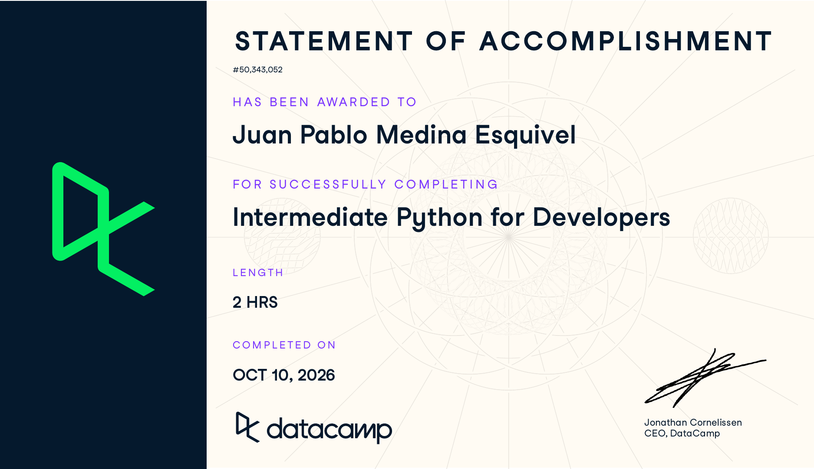

# Certificado: Intermediate Python for Developers

## Quién soy
- Usuario de GitHub: jpmedinae
- Usuario de DataCamp: jpmedinae

## Intermediate Python for Developers
Fecha en que lo terminaste (AAAA-MM-DD): 2026-10-10
URL del Statement of Accomplishment: https://www.datacamp.com/completed/statement-of-accomplishment/course/ce54fc20ec6b1f6277e1c5bff625c747a3398056

## Una cosa que aprendiste y no sabías
Aprendí a utilizar *args y **kwargs para crear funciones que reciben un número variable de argumentos posicionales y argumentos con nombre, respectivamente.